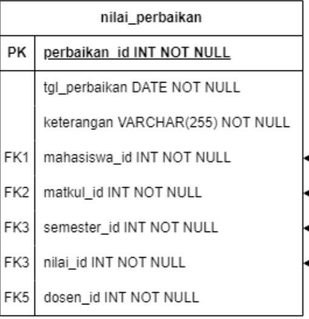
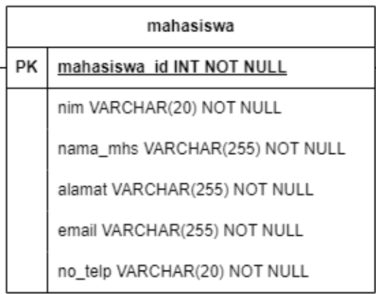

# Tugas 2

#### Nama : Josindo Radit Albaran<br>
#### NIM  : 230302064<br>
#### Kelas  :TI-2C
<br>

<center><b>Task 2</b></center>
<center><b>Web Programming Practicum II
Implemented CRUD using PHP OOP</b></center><br>

<div align="justify">
A. Introduction
The Web-Based Correspondence Information System for Lecturers of the
Computer and Business Department is a platform designed to simplify the
management of official letters and documents between lecturers and department
administration. This system enables lecturers to submit, track, and manage
correspondence such as requests for leave, official memos, and other administrative
documents online. By digitizing the process, it enhances efficiency, accuracy, and
accessibility, while reducing paperwork and streamlining communication within the
department.
B. User Roles
The system supports four distinct user roles:
1. Administrator
2. Bag Administrasi (Admission)
3. Koor Prodi (Program Coordinator)
4. Dosen (Lecturer)

<br>


<b>Case Study:</b>
- NPM 1,2: mahasiswa & nilai
- NPM 3,4: mahasiswa & nilai_perbaikan
- NPM 5,6: surat_tugas & permohonan_izin
- NPM 7,8: penggantian_pengawas_ujian & laporan_kerja_lembur
- NPM 9,0: izin_ketidakhadiran_pegawai
<br><br><b>Task:</b>
1. Create an OOP-based View, by retrieving data from the MySQL database
2. Use the _construct as a link to the database
3. Apply encapsulation according to the logic of the case study
4. Create a derived class using the concept of inheritance
5. Apply polymorphism for at least 2 roles according to the case study
<br><br><b>Rule:</b>
1. Individual group assignments
2. Use the github repository
3. Submit via Google Classroom
4. Deadline is Friday 18 Oct 2024 at 11.00 am
<br><br><b>Evaluation:</b><br>
o Timeliness (20%)<br>
o Documentation (40%)<br>
o Originality (40%)

## Table :




## DataBase :
### #Db Mahasiswa
<br>

### Data Mahasiswa
<br>

### #Db Nilai_perbaikan

<br>

### Data Nilai_Perbaikan
<br>


## 1.Membuat Tampilan Awal/Index
### #Tamipaln Awal/Index

```php
<?php
// Mengecek apakah parameter 'role' ada di URL
if(isset($_GET['role'])){
    $role = $_GET['role'];
    
    // Menentukan nilai $x berdasarkan peran
    if($role == "admin"){
        $x="?role=admin";
    }else if($role == "dosen"){
        $x="?role=dosen";
    }
}
?>
<!DOCTYPE html>
<html lang="en" class="h-100">
<head>
  <meta charset="UTF-8">
  <meta name="viewport" content="width=device-width, initial-scale=1.0">
  <title>Document</title>
  <!-- Link ke Bootstrap CSS dari CDN -->
  <link href="https://cdn.jsdelivr.net/npm/bootstrap@5.3.3/dist/css/bootstrap.min.css" rel="stylesheet" integrity="sha384-QWTKZyjpPEjISv5WaRU9OFeRpok6YctnYmDr5pNlyT2bRjXh0JMhjY6hW+ALEwIH" crossorigin="anonymous">
  <!-- Link ke Bootstrap JavaScript dari CDN -->
  <script src="https://cdn.jsdelivr.net/npm/bootstrap@5.3.3/dist/js/bootstrap.bundle.min.js" integrity="sha384-YvpcrYf0tY3lHB60NNkmXc5s9fDVZLESaAA55NDzOxhy9GkcIdslK1eN7N6jIeHz" crossorigin="anonymous"></script>
</head>
<body class="h-100">
 <!-- Bagian navigasi menggunakan Bootstrap Navbar -->
 <nav class="navbar navbar-expand-lg navbar-dark bg-dark">
  <div class="container-fluid">
    <a class="navbar-brand" href="#">TUGAS 2</a>
    <!-- Tombol untuk tampilan responsif pada perangkat kecil -->
    <button class="navbar-toggler" type="button" data-bs-toggle="collapse" data-bs-target="#navbarNavDropdown" aria-controls="navbarNavDropdown" aria-expanded="false" aria-label="Toggle navigation">
      <span class="navbar-toggler-icon"></span>
    </button>
    <div class="collapse navbar-collapse" id="navbarNavDropdown">
      <ul class="navbar-nav">
        <!-- Dropdown menu untuk Administrator -->
        <li class="nav-item dropdown">
          <a class="nav-link dropdown-toggle" href="#" role="button" data-bs-toggle="dropdown" aria-expanded="false">Administrator</a>
          <ul class="dropdown-menu">
            <!-- Link ke halaman 'mahasiswa.php' dengan parameter 'role=admin' -->
            <li><a class="dropdown-item" href="mahasiswa.php?role=admin">Mahasiswa</a></li>
            <!-- Link ke halaman 'nilai_perbaikan.php' dengan parameter 'role=admin' -->
            <li><a class="dropdown-item" href="nilai_perbaikan.php?role=admin">Nilai Perbaikan</a></li>
          </ul>
        </li>
        <!-- Dropdown menu untuk Dosen -->
        <li class="nav-item dropdown">
          <a class="nav-link dropdown-toggle" href="#" role="button" data-bs-toggle="dropdown" aria-expanded="false">Dosen</a>
          <ul class="dropdown-menu">
            <!-- Link ke halaman 'mahasiswa.php' dengan parameter 'role=dosen' -->
            <li><a class="dropdown-item" href="mahasiswa.php?role=dosen">Mahasiswa</a></li>
            <!-- Link ke halaman 'nilai_perbaikan.php' dengan parameter 'role=dosen' -->
            <li><a class="dropdown-item" href="nilai_perbaikan.php?role=dosen">Nilai Perbaikan</a></li>
          </ul>
        </li>
      </ul>
    </div>
  </div>
</nav>

<!-- Bagian tengah halaman dengan teks "Welcome!!" yang diposisikan di tengah -->
<div class="d-flex justify-content-center align-items-center h-100">
  <h1 class="text-black">Welcome!!</h1><br>
</div>
</body>
</html>

```

### #Menentukan Role

```php
<?php
// Mengecek apakah parameter 'role' ada di URL
if(isset($_GET['role'])){
    $role = $_GET['role'];
    
    // Menentukan nilai $x berdasarkan peran
    if($role == "admin"){
        $x="?role=admin";
    }else if($role == "dosen"){
        $x="?role=dosen";
    }
}
?>
```


 ### # Membuat Navbar

```php
<!DOCTYPE html>
<html lang="en" class="h-100">
<head>
  <meta charset="UTF-8">
  <meta name="viewport" content="width=device-width, initial-scale=1.0">
  <title>Document</title>
  <!-- Link ke Bootstrap CSS dari CDN -->
  <link href="https://cdn.jsdelivr.net/npm/bootstrap@5.3.3/dist/css/bootstrap.min.css" rel="stylesheet" integrity="sha384-QWTKZyjpPEjISv5WaRU9OFeRpok6YctnYmDr5pNlyT2bRjXh0JMhjY6hW+ALEwIH" crossorigin="anonymous">
  <!-- Link ke Bootstrap JavaScript dari CDN -->
  <script src="https://cdn.jsdelivr.net/npm/bootstrap@5.3.3/dist/js/bootstrap.bundle.min.js" integrity="sha384-YvpcrYf0tY3lHB60NNkmXc5s9fDVZLESaAA55NDzOxhy9GkcIdslK1eN7N6jIeHz" crossorigin="anonymous"></script>
</head>
<body class="h-100">
 <!-- Bagian navigasi menggunakan Bootstrap Navbar -->
 <nav class="navbar navbar-expand-lg navbar-dark bg-dark">
  <div class="container-fluid">
    <a class="navbar-brand" href="#">TUGAS 2</a>
    <!-- Tombol untuk tampilan responsif pada perangkat kecil -->
    <button class="navbar-toggler" type="button" data-bs-toggle="collapse" data-bs-target="#navbarNavDropdown" aria-controls="navbarNavDropdown" aria-expanded="false" aria-label="Toggle navigation">
      <span class="navbar-toggler-icon"></span>
    </button>
    <div class="collapse navbar-collapse" id="navbarNavDropdown">
      <ul class="navbar-nav">
        <!-- Dropdown menu untuk Administrator -->
        <li class="nav-item dropdown">
          <a class="nav-link dropdown-toggle" href="#" role="button" data-bs-toggle="dropdown" aria-expanded="false">Administrator</a>
          <ul class="dropdown-menu">
            <!-- Link ke halaman 'mahasiswa.php' dengan parameter 'role=admin' -->
            <li><a class="dropdown-item" href="mahasiswa.php?role=admin">Mahasiswa</a></li>
            <!-- Link ke halaman 'nilai_perbaikan.php' dengan parameter 'role=admin' -->
            <li><a class="dropdown-item" href="nilai_perbaikan.php?role=admin">Nilai Perbaikan</a></li>
          </ul>
        </li>
        <!-- Dropdown menu untuk Dosen -->
        <li class="nav-item dropdown">
          <a class="nav-link dropdown-toggle" href="#" role="button" data-bs-toggle="dropdown" aria-expanded="false">Dosen</a>
          <ul class="dropdown-menu">
            <!-- Link ke halaman 'mahasiswa.php' dengan parameter 'role=dosen' -->
            <li><a class="dropdown-item" href="mahasiswa.php?role=dosen">Mahasiswa</a></li>
            <!-- Link ke halaman 'nilai_perbaikan.php' dengan parameter 'role=dosen' -->
            <li><a class="dropdown-item" href="nilai_perbaikan.php?role=dosen">Nilai Perbaikan</a></li>
          </ul>
        </li>
      </ul>
    </div>
  </div>
</nav>

<!-- Bagian tengah halaman dengan teks "Welcome!!" yang diposisikan di tengah -->
<div class="d-flex justify-content-center align-items-center h-100">
  <h1 class="text-black">Welcome!!</h1><br>
</div>
</body>
</html>
```

## #Output


### #Catatan Role dan Navbar
Didalam tampilan awal ini terdapat role yang di pegang oleh administator dan dosen(dialam role adminitrator pada tabel mahasiswa, administrator bisa melihat Nama, Nim, Alamat, No_telpon dan pada tabel nilai perbaikan administrator bisa melihat tgl perbaikan, Keterangan, Id mahasiswa sedangkan pada role dosen pada table mahasiswa hanya bisa melihat Nim, Nama, Email, dan pada table nilai perbaikan dosen hanya bisa melihat Keterangan, Id mahasiswa ).

Didalam tampilan awal ini juga terdapat navbar yang terdiri dari administrator dan dosen dan didalam administrator dan dosen terdapat choice/pilihan mahasiswa dan nilai_perbaikan. 
#### Saya Membuat Role nya sesudah membuat koneksi  dan databasenya.


## #2. Membuat DATABASE Mahasiswa, Koneksi, dan Menentukan Role

```php

<?php
// Kelas dataconnect berfungsi untuk membuat koneksi ke database
class dataconnect {
    // Mendefinisikan properti untuk koneksi database
    private $servername = "localhost";
    private $username = "root"; 
    private $password = ""; 
    private $dbname = "pweb_tugas2";

    // Konstruktor untuk menginisialisasi koneksi ke database
    public function __construct(){
        // Membuat objek mysqli untuk koneksi ke database
        $db = new mysqli($this->servername, $this->username, $this->password, $this->dbname);
        return $db;  // Mengembalikan objek koneksi
    }
}

// Kelas dosen untuk menampilkan data mahasiswa dengan informasi yang terbatas
class dosen extends dataconnect {
    // Fungsi untuk menampilkan tabel mahasiswa
    public function tblmahasiswa($table) {
        // Mengambil data dari tabel mahasiswa menggunakan query SQL
        $data = parent::__construct()->query("SELECT * FROM mahasiswa");

        ?>
        <!-- Membuat tabel HTML untuk menampilkan data -->
        <table class="table table-bordered table-striped">
         <tr>
            <td><center><b>Nim</b></center></td>
            <td><center><b>Nama</b></center></td>
            <td><center><b>Email</b></center></td>
         </tr>
        <?php
        // Looping untuk menampilkan setiap baris data mahasiswa
         foreach ($data as $a){
        ?>
            <tr>
                <td><?= $a['nim']?> </td>
                <td><?= $a['nama_mhs']?> </td>
                <td><?= $a['email']?> </td>
            </tr>
        <?php 
        } 
        ?>
        </table>
        <?php    
    }
}

// Kelas admin untuk menampilkan data mahasiswa dengan informasi yang lebih lengkap
class admin extends dataconnect {
    // Fungsi untuk menampilkan tabel mahasiswa
    public function tblmahasiswa($table) {
        // Mengambil data dari tabel mahasiswa menggunakan query SQL
        $data = parent::__construct()->query("SELECT * FROM mahasiswa");
        ?>
        <!-- Membuat tabel HTML untuk menampilkan data dengan kolom tambahan -->
        <table class="table table-bordered table-striped">
        <tr>
            <td><b><center>Nim</center></b></td>
            <td><b><center>Nama</center></b></td>
            <td><b><center>Alamat</center></b></td>
            <td><b><center>Email</center></b></td>
            <td><b><center>No_Telp</center></b></td>
        </tr>
        <?php
        // Looping untuk menampilkan setiap baris data mahasiswa
        foreach ($data as $a){
        ?>
            <tr>
                <td><?= $a['nim']?> </td>
                <td><?= $a['nama_mhs']?> </td>
                <td><?= $a['alamat']?> </td>
                <td><?= $a['email']?> </td>
                <td><?= $a['no_telp']?> </td>
            </tr>
        <?php
        }
        // Menutup tag tabel
        echo "</table>";
    }
}
?>
```

### #Membuat Koneksi Mahasiswa

```php
<?php
// Kelas dataconnect berfungsi untuk membuat koneksi ke database
class dataconnect {
    // Mendefinisikan properti untuk koneksi database
    private $servername = "localhost";
    private $username = "root"; 
    private $password = ""; 
    private $dbname = "pweb_tugas2";

    // Konstruktor untuk menginisialisasi koneksi ke database
    public function __construct(){
        // Membuat objek mysqli untuk koneksi ke database
        $db = new mysqli($this->servername, $this->username, $this->password, $this->dbname);
        return $db;  // Mengembalikan objek koneksi
    }
}
```
### Catatan Koneksi Mahasiswa
Setelah itu membuat sebuah kelas yang dinamakan dataconnect tujuanya untuk menghubungkan ke database PHP myadmin. Di dalam kelas ini, mendefinisikan beberapa properti privat yang menyimpan informasi penting untuk koneksi database, antara lain:
<br>$servername
<br>$username
<br>$password
<br>$dbname
<br>Didalam koneksi ini menggunakan konsep enkapsulasi karena menggunakan privat untuk melindungi properti dan pada function consctruct berfungsi untuk mrnginilialisasi.

### #Membuat DataBase Mahasiswa


```php
// Kelas dosen untuk menampilkan data mahasiswa dengan informasi yang terbatas
class dosen extends dataconnect {
    // Fungsi untuk menampilkan tabel mahasiswa
    public function tblmahasiswa($table) {
        // Mengambil data dari tabel mahasiswa menggunakan query SQL
        $data = parent::__construct()->query("SELECT * FROM mahasiswa");

        ?>
        <!-- Membuat tabel HTML untuk menampilkan data -->
        <table class="table table-bordered table-striped">
         <tr>
            <td><center><b>Nim</b></center></td>
            <td><center><b>Nama</b></center></td>
            <td><center><b>Email</b></center></td>
         </tr>
        <?php
        // Looping untuk menampilkan setiap baris data mahasiswa
         foreach ($data as $a){
        ?>
            <tr>
                <td><?= $a['nim']?> </td>
                <td><?= $a['nama_mhs']?> </td>
                <td><?= $a['email']?> </td>
            </tr>
        <?php 
        } 
        ?>
        </table>
        <?php    
    }
}

// Kelas admin untuk menampilkan data mahasiswa dengan informasi yang lebih lengkap
class admin extends dataconnect {
    // Fungsi untuk menampilkan tabel mahasiswa
    public function tblmahasiswa($table) {
        // Mengambil data dari tabel mahasiswa menggunakan query SQL
        $data = parent::__construct()->query("SELECT * FROM mahasiswa");
        ?>
        <!-- Membuat tabel HTML untuk menampilkan data dengan kolom tambahan -->
        <table class="table table-bordered table-striped">
        <tr>
            <td><b><center>Nim</center></b></td>
            <td><b><center>Nama</center></b></td>
            <td><b><center>Alamat</center></b></td>
            <td><b><center>Email</center></b></td>
            <td><b><center>No_Telp</center></b></td>
        </tr>
        <?php
        // Looping untuk menampilkan setiap baris data mahasiswa
        foreach ($data as $a){
        ?>
            <tr>
                <td><?= $a['nim']?> </td>
                <td><?= $a['nama_mhs']?> </td>
                <td><?= $a['alamat']?> </td>
                <td><?= $a['email']?> </td>
                <td><?= $a['no_telp']?> </td>
            </tr>
        <?php
        }
        // Menutup tag tabel
        echo "</table>";
    }
}
?>

```
### Catatan DataBase Mahasiswa

Dalam class dosen terdapat konsep inheritance(turunan) yaitu pada bagian class dataconect extend class dosen dan pada class admin juga terdapat konsep inherintance yaitu admin extend, Dalam code pada class dosen dan class admin juga menggunakan konsep polymorpsm yaitu di  bagian function tblmahasiswa pada class dosen dan function yang sma juga di class admin tapi isinya berbeda menyesuaikan dengan rolenya, dan pada bagian foreach berguna untuk mengambil data dari data base. Kedua class, dosen dan admin, menggunakan koneksi yang disediakan oleh class dataconnect untuk mengambil data dari tabel mahasiswa di database. Class dosen hanya menampilkan informasi dasar mahasiswa, sementara Class admin menampilkan lebih banyak detail. Perbedaan utama antara keduanya adalah jumlah kolom yang ditampilkan. 


### #Menentukan Role

```php
<!DOCTYPE html>
<html>
<head>
    <!-- Judul halaman dengan teks yang berada di tengah -->
	<title><center><br>Data Mahasiswa (Dosen)</center><br></title>
    
    <!-- Memuat stylesheet Bootstrap dari CDN -->
    <link href="https://cdn.jsdelivr.net/npm/bootstrap@5.3.3/dist/css/bootstrap.min.css" rel="stylesheet" integrity="sha384-QWTKZyjpPEjISv5WaRU9OFeRpok6YctnYmDr5pNlyT2bRjXh0JMhjY6hW+ALEwIH" crossorigin="anonymous">
    
    <!-- Memuat JavaScript Bootstrap dari CDN -->
	<script src="https://cdn.jsdelivr.net/npm/bootstrap@5.3.3/dist/js/bootstrap.bundle.min.js" integrity="sha384-YvpcrYf0tY3lHB60NNkmXc5s9fDVZLESaAA55NDzOxhy9GkcIdslK1eN7N6jIeHz" crossorigin="anonymous"></script>
    
    <!-- Mengulang link dan script Bootstrap (sebaiknya hapus duplikat ini untuk efisiensi) -->
	<link href="https://cdn.jsdelivr.net/npm/bootstrap@5.3.3/dist/css/bootstrap.min.css" rel="stylesheet" integrity="sha384-QWTKZyjpPEjISv5WaRU9OFeRpok6YctnYmDr5pNlyT2bRjXh0JMhjY6hW+ALEwIH" crossorigin="anonymous">
	<script src="https://cdn.jsdelivr.net/npm/bootstrap@5.3.3/dist/js/bootstrap.bundle.min.js" integrity="sha384-YvpcrYf0tY3lHB60NNkmXc5s9fDVZLESaAA55NDzOxhy9GkcIdslK1eN7N6jIeHz" crossorigin="anonymous"></script>
</head>

<!-- Membuat body dengan kelas Bootstrap dan ketinggian yang sangat besar -->
<body class="container h-1000000">
    <!-- Header teks untuk judul data mahasiswa -->
	<h2><center>Data Mahasiswa</center><br></h2>
	
    <!-- Membuat tabel dengan border -->
	<table border="1">
		
		<?php 
		// Meng-include file 'database_M.php' untuk menggunakan kelas dan fungsi yang didefinisikan di dalamnya
		include 'database_M.php';
        
        // Cek apakah parameter 'role' di URL berisi "dosen"
		if($_GET['role']=="dosen"){
			// Membuat objek baru dari kelas dosen dan memanggil fungsi tblmahasiswa() 
			$x = new dosen();
			$x->tblmahasiswa("mahasiswa");
		}
        // Jika parameter 'role' berisi "admin"
		else if($_GET['role'] == "admin"){
			// Membuat objek baru dari kelas admin dan memanggil fungsi tblmahasiswa()
			$x = new admin();
			$x->tblmahasiswa("mahasiswa");
		}
		?>
	</table>
    
    <!-- Link untuk kembali ke halaman index.php dengan tombol berwarna biru dari Bootstrap -->
	<a href="index.php" class="btn btn-primary">Kembali</a>
</body>
</html>
```
### Catatan Menentukan Role 

Code ini mengatur tampilan data mahasiswa berdasarkan role yang diberikan. Dengan parameter role, halaman ini dapat menampilkan informasi yang sesuai untuk pengguna dengan role tertentu (dosen atau admin). Pada potongan code ini juga menerapkan konsep polimorpshm dibagian logika if else.

## Output Data Mahasiswa Admin


## Output Data Mahasiswa Dosen


## 3. Membuat DATABASE Nilai_Perbaikan, Koneksi, dan Menentukan Role

```php
<?php
// Kelas dataconnect digunakan untuk menghubungkan ke database
class dataconnect {
    // Mendefinisikan properti yang diperlukan untuk koneksi ke database
    private $servername = "localhost";
    private $username = "root"; 
    private $password = ""; 
    private $dbname = "pweb_tugas2";

    // Konstruktor untuk menginisialisasi koneksi ke database
    public function __construct(){
        // Membuat objek mysqli untuk koneksi ke database
        $db = new mysqli($this->servername, $this->username, $this->password, $this->dbname);
        return $db;  // Mengembalikan objek koneksi
    }
}

// Kelas dosen merupakan turunan dari dataconnect dan menampilkan tabel nilai_perbaikan dengan informasi terbatas
class dosen extends dataconnect {
    // Fungsi untuk menampilkan tabel nilai perbaikan
    public function tblnilai_perbaikan($table) {
        // Mengambil data dari tabel nilai_perbaikan dengan query SQL
        $data = parent::__construct()->query("SELECT * FROM nilai_perbaikan");

        ?>
        <!-- Membuat tabel HTML untuk menampilkan data nilai perbaikan dengan informasi terbatas -->
        <table class="table table-bordered table-striped">
         <tr>
            <td><b><center>Keterangan</center></b></td>
            <td><b><center>Id_Mahasiswa</center></b></td>
         </tr>
         
        <?php
         // Looping untuk menampilkan setiap baris data nilai perbaikan
         foreach ($data as $a) {
        ?>
            <tr>
                <td><?= $a['keterangan'] ?> </td>
                <td><?= $a['id_mahasiswa'] ?> </td>
            </tr>
        <?php 
        } 
        ?>
        </table>
        <?php    
    }
}

// Kelas admin merupakan turunan dari dataconnect dan menampilkan tabel nilai_perbaikan dengan informasi lebih lengkap
class admin extends dataconnect {
    // Fungsi untuk menampilkan tabel nilai perbaikan
    public function tblnilai_perbaikan($table) {
        // Mengambil data dari tabel nilai_perbaikan dengan query SQL
        $data = parent::__construct()->query("SELECT * FROM nilai_perbaikan");

        ?>
        <!-- Membuat tabel HTML untuk menampilkan data nilai perbaikan dengan informasi lebih lengkap -->
        <table class="table table-bordered table-striped">
        <tr>
            <td><b><center>Tanggal Perbaikan</center></b></td>
            <td><b><center>Keterangan</center></b></td>
            <td><b><center>Id_Mahasiswa</center></b></td>
        </tr>
        
        <?php
        // Looping untuk menampilkan setiap baris data nilai perbaikan
        foreach ($data as $a) {
        ?>
            <tr>
                <td><?= $a['tgl_perbaikan'] ?> </td>
                <td><?= $a['keterangan'] ?> </td>
                <td><?= $a['id_mahasiswa'] ?></td>
            </tr>
        <?php
        }
        // Menutup tabel
        echo "</table>";
    }
}
?>
```


### #Membuat Koneksi Nilai Perbaikan

```php
<?php
// Kelas dataconnect digunakan untuk menghubungkan ke database
class dataconnect {
    // Mendefinisikan properti yang diperlukan untuk koneksi ke database
    private $servername = "localhost";
    private $username = "root"; 
    private $password = ""; 
    private $dbname = "pweb_tugas2";

    // Konstruktor untuk menginisialisasi koneksi ke database
    public function __construct(){
        // Membuat objek mysqli untuk koneksi ke database
        $db = new mysqli($this->servername, $this->username, $this->password, $this->dbname);
        return $db;  // Mengembalikan objek koneksi
    }
}
```
### Catatan Koneksi Nilai Perbaikan

Setelah itu membuat sebuah kelas yang dinamakan dataconnect tujuanya untuk menghubungkan ke database PHP myadmin. Di dalam kelas ini, mendefinisikan beberapa properti privat yang menyimpan informasi penting untuk koneksi database, antara lain:
<br>$servername
<br>$username
<br>$password
<br>$dbname
<br>Didalam koneksi ini menggunakan konsep enkapsulasi karena menggunakan privat untuk melindungi properti sama seperti database mahasiswa.


### #Membuat DataBase Nilai Perbaikan


```php
// Kelas dosen merupakan turunan dari dataconnect dan menampilkan tabel nilai_perbaikan dengan informasi terbatas
class dosen extends dataconnect {
    // Fungsi untuk menampilkan tabel nilai perbaikan
    public function tblnilai_perbaikan($table) {
        // Mengambil data dari tabel nilai_perbaikan dengan query SQL
        $data = parent::__construct()->query("SELECT * FROM nilai_perbaikan");

        ?>
        <!-- Membuat tabel HTML untuk menampilkan data nilai perbaikan dengan informasi terbatas -->
        <table class="table table-bordered table-striped">
         <tr>
            <td><b><center>Keterangan</center></b></td>
            <td><b><center>Id_Mahasiswa</center></b></td>
         </tr>
         
        <?php
         // Looping untuk menampilkan setiap baris data nilai perbaikan
         foreach ($data as $a) {
        ?>
            <tr>
                <td><?= $a['keterangan'] ?> </td>
                <td><?= $a['id_mahasiswa'] ?> </td>
            </tr>
        <?php 
        } 
        ?>
        </table>
        <?php    
    }
}

// Kelas admin merupakan turunan dari dataconnect dan menampilkan tabel nilai_perbaikan dengan informasi lebih lengkap
class admin extends dataconnect {
    // Fungsi untuk menampilkan tabel nilai perbaikan
    public function tblnilai_perbaikan($table) {
        // Mengambil data dari tabel nilai_perbaikan dengan query SQL
        $data = parent::__construct()->query("SELECT * FROM nilai_perbaikan");

        ?>
        <!-- Membuat tabel HTML untuk menampilkan data nilai perbaikan dengan informasi lebih lengkap -->
        <table class="table table-bordered table-striped">
        <tr>
            <td><b><center>Tanggal Perbaikan</center></b></td>
            <td><b><center>Keterangan</center></b></td>
            <td><b><center>Id_Mahasiswa</center></b></td>
        </tr>
        
        <?php
        // Looping untuk menampilkan setiap baris data nilai perbaikan
        foreach ($data as $a) {
        ?>
            <tr>
                <td><?= $a['tgl_perbaikan'] ?> </td>
                <td><?= $a['keterangan'] ?> </td>
                <td><?= $a['id_mahasiswa'] ?></td>
            </tr>
        <?php
        }
        // Menutup tabel
        echo "</table>";
    }
}
?>

```
### #Catatan DataBase Nilai_Perbaikan

Dalam class dosen terdapat konsep inheritance(turunan) yaitu class dataconect extend class dosen dan pada class admin juga terdapat konsep inherintance yaitu admin extend, Dalam codingan pada class dosen dan class admin juga menggunakan konsep polymorpsm yaitu di function tblniali_perbaikan pada class dosen dan function yang sama juga di class admin tapi isinya berbeda menyesuaikan dengan rolenya dan pada bagian foreach berguna untuk mengambil data dari data base. . Kedua class, dosen dan admin, menggunakan koneksi yang disediakan oleh class dataconnect untuk mengambil data dari tabel mahasiswa di database. Kelas dosen hanya menampilkan informasi dasar mahasiswa, sementara kelas admin menampilkan lebih banyak detail. Perbedaan utama antara keduanya adalah jumlah kolom yang ditampilkan.


### #Menentukan Role

```php
<!DOCTYPE html>
<html>
<head>
    <!-- Judul halaman, berisi teks yang berada di tengah -->
	<title><center>Data Nilai Perbaikan</center></title>
    
    <!-- Memuat stylesheet Bootstrap dari CDN untuk styling yang rapi dan responsif -->
    <link href="https://cdn.jsdelivr.net/npm/bootstrap@5.3.3/dist/css/bootstrap.min.css" rel="stylesheet" integrity="sha384-QWTKZyjpPEjISv5WaRU9OFeRpok6YctnYmDr5pNlyT2bRjXh0JMhjY6hW+ALEwIH" crossorigin="anonymous">
    
    <!-- Memuat JavaScript Bootstrap dari CDN untuk fungsi interaktif (misalnya dropdowns, modals) -->
    <script src="https://cdn.jsdelivr.net/npm/bootstrap@5.3.3/dist/js/bootstrap.bundle.min.js" integrity="sha384-YvpcrYf0tY3lHB60NNkmXc5s9fDVZLESaAA55NDzOxhy9GkcIdslK1eN7N6jIeHz" crossorigin="anonymous"></script>
    
    <!-- Duplikat link dan script Bootstrap (sebaiknya hapus duplikat ini untuk efisiensi) -->
	<link href="https://cdn.jsdelivr.net/npm/bootstrap@5.3.3/dist/css/bootstrap.min.css" rel="stylesheet" integrity="sha384-QWTKZyjpPEjISv5WaRU9OFeRpok6YctnYmDr5pNlyT2bRjXh0JMhjY6hW+ALEwIH" crossorigin="anonymous">
	<script src="https://cdn.jsdelivr.net/npm/bootstrap@5.3.3/dist/js/bootstrap.bundle.min.js" integrity="sha384-YvpcrYf0tY3lHB60NNkmXc5s9fDVZLESaAA55NDzOxhy9GkcIdslK1eN7N6jIeHz" crossorigin="anonymous"></script>
</head>
<!-- Membuat body halaman dengan class container Bootstrap untuk layout yang rapi dan h-100 untuk tinggi penuh -->
<body class="container h-100">
 
    <!-- Header teks untuk judul "Data Nilai Perbaikan" dengan teks terpusat -->
	<h2><center>Data Nilai Perbaikan<br></center></h2><br>
	
    <!-- Membuat tabel HTML dengan border -->
	<table border="1"><br>
		
		<?php 
		// Meng-include file 'database_N.php' yang kemungkinan berisi kelas dosen dan admin
		include 'database_N.php';
        
        // Mengecek apakah parameter 'role' di URL adalah "dosen"
        if($_GET['role']=="dosen"){
			// Membuat objek baru dari kelas dosen dan memanggil metode tblnilai_perbaikan()
			$x = new dosen();
			$x->tblnilai_perbaikan("nilai_perbaikan");
		}
        // Jika parameter 'role' adalah "admin"
        else if($_GET['role'] == "admin"){
			// Membuat objek baru dari kelas admin dan memanggil metode tblnilai_perbaikan()
			$x = new admin();
			$x->tblnilai_perbaikan("nilai_perbaikan");
		}
		?>
	</table>
    
    <!-- Tombol kembali ke halaman index.php, menggunakan class btn-primary dari Bootstrap -->
    <a href="index.php" class="btn btn-primary">Kembali</a>
</body>
</html>
```
### Catatan Menentukan Role 

Code ini mengatur tampilan data Nilai Perbaikan berdasarkan role yang diberikan kepada dosen dan admin. Dengan parameter role, halaman ini dapat menampilkan informasi yang sesuai untuk pengguna dengan role tertentu (dosen atau admin). Pada potongan code ini juga menerapkan konsep polimorpshm dibagian logika if else.

## Output Data Nilai Perbaikan Admin


## Output Data Nilai Perbaikan Dosen

<div>